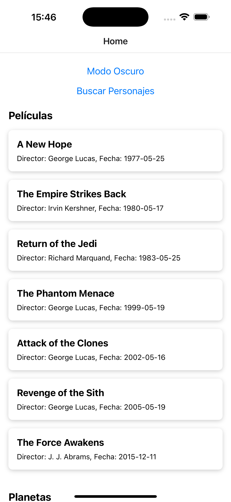
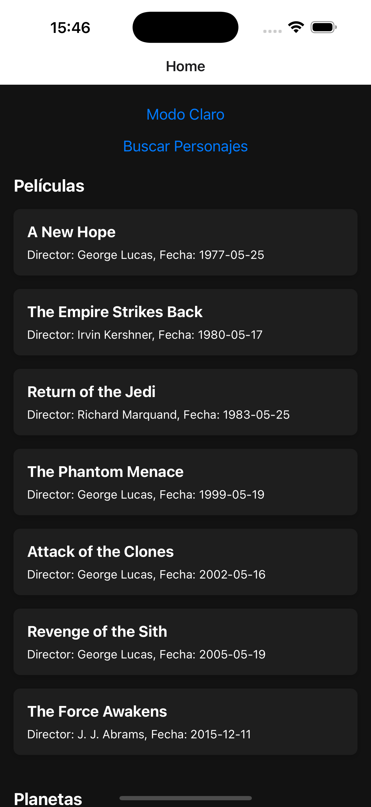
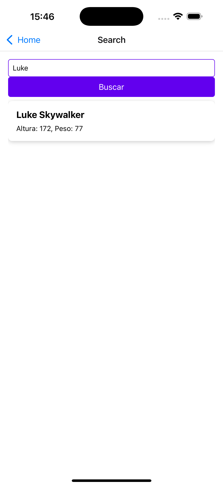
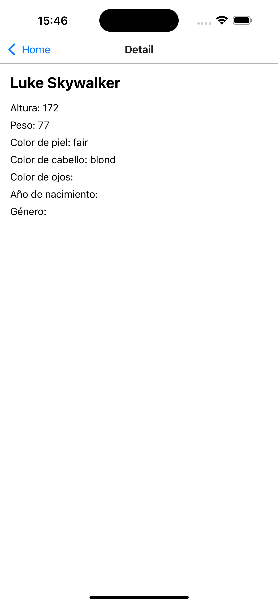

# StarWarsApp

Aplicación móvil desarrollada con **React Native** que muestra información sobre películas, planetas y personajes de Star Wars utilizando la API [SWAPI](https://swapi.py4e.com/). La aplicación sigue el patrón **Atomic Design** y usa **TypeScript** para un desarrollo más seguro y escalable.

----------

## 🔍 Características

-   **Listado de películas, planetas y personajes**: Información detallada extraída de SWAPI.
-   **Buscador de personajes**: Permite buscar personajes por nombre.
-   **Modo oscuro y claro**: Soporte para cambio de tema dinámico.
-   **Navegación intuitiva**: Home, buscador y detalles de personajes.
-   **Integración con SWAPI**: Datos en tiempo real sobre el universo de Star Wars.

----------

## 💻 Tecnologías Utilizadas

-   **React Native** - Framework para desarrollo móvil.
-   **TypeScript** - Tipado estático para mayor seguridad.
-   **React Query** - Manejo eficiente del estado de datos.
-   **React Navigation** - Navegación fluida entre pantallas.
-   **React Native Paper** - Componentes UI con soporte de temas.
-   **SWAPI** - API para obtener información de Star Wars.

----------

## 🌐 Estructura del Proyecto

El proyecto sigue **Atomic Design** para organizar los componentes:

```
src/
├── components/
│   ├── atoms/        # Componentes pequeños y reutilizables (Text, Button, Input)
│   ├── molecules/    # Combinación de átomos (SearchBar, Card)
│   ├── organisms/    # Combinación de moléculas (FilmList, PlanetList, PeopleList)
│   └── templates/    # Estructuras de layout (MainTemplate)
├── screens/          # Pantallas de la aplicación (HomeScreen, SearchScreen, DetailScreen)
├── services/         # Lógica para interactuar con la API (api.ts)
├── styles/           # Estilos globales y temas (theme.ts, globalStyles.ts)
├── utils/            # Funciones utilitarias (translate.ts)
├── App.tsx           # Punto de entrada de la aplicación
└── index.js          # Archivo principal de la aplicación

```

----------

## 🛠️ Configuración del Proyecto

### 🔗 Requisitos Previos

-   **Node.js**: [Descargar Node.js](https://nodejs.org/)
-   **React Native CLI**:
    
    ```bash
    npm install -g react-native-cli
    
    ```
    

### 📖 Instalación

1.  Clona el repositorio:
    
    ```bash
    git clone https://github.com/danielullauri93/StarWarsApp.git
    cd StarWarsApp
    
    ```
    
2.  Instala las dependencias:
    
    ```bash
    npm install
    
    ```
    
3.  Configura el entorno:
    
    -   Para iOS:
        
        ```bash
        cd ios && pod install && cd ..
        
        ```
        
4.  Ejecuta la aplicación:
    
    -   En iOS:
        
        ```bash
        npx react-native run-ios
        
        ```
        
    -   En Android:
        
        ```bash
        npx react-native run-android
        
        ```
        

----------

## 📱 Uso de la Aplicación

1.  **Pantalla de Inicio**:
    
    -   Listado de películas, planetas y personajes.
    -   Botón para cambiar entre modo claro y oscuro.
    -   Campo de búsqueda para filtrar personajes.
2.  **Pantalla de Búsqueda**:
    
    -   Busca personajes en tiempo real.
    -   Resultados mostrados de forma dinámica.
3.  **Pantalla de Detalle**:
    
    -   Información detallada sobre un personaje seleccionado.

----------

## 🖼️ Capturas de Pantalla

Modo Claro



Modo Oscuro



Buscador Personajes



Detalle Personajes




----------

## ✨ Contribución

Si deseas contribuir, sigue estos pasos:

1.  Haz un fork del repositorio.
2.  Crea una nueva rama:
    
    ```bash
    git checkout -b feature/nueva-funcionalidad
    
    ```
    
3.  Realiza tus cambios y haz commit:
    
    ```bash
    git commit -m "Agrega nueva funcionalidad"
    
    ```
    
4.  Sube tus cambios:
    
    ```bash
    git push origin feature/nueva-funcionalidad
    
    ```
    
5.  Abre un Pull Request en GitHub.

----------

## 👤 Autor

-   **Daniel Ullauri** - [GitHub](https://github.com/danielullauri93)

----------

🚀 **¡Gracias por usar StarWarsApp!** Si tienes dudas o sugerencias, no dudes en contactarme. 🙂